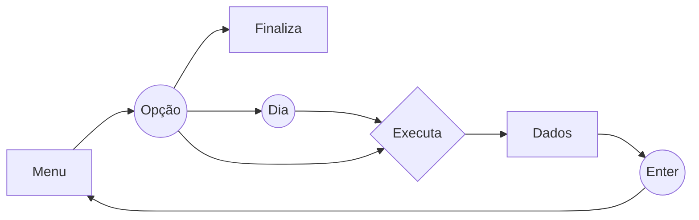


# Dados da COVID-19 no Brasil (C++)

Programa desenvolvido pelo discente *Alysson Patrick Regis da Rocha* durante o curso de **EEL670 - Linguagens de Programação** ministrado por **Miguel Elias Mitre Campista** no período de 2020/2.

## Objetivos
O programa tem como objetivo exibir dados da COVID-19 no Brasil. Para isso, utiliza-se os conceitos de Programação Orientada a Objetos, com a presença de uma classe Country que contém um atibuto de vetores de outra classe chamada State. Desse modo, é possível consumir dados dos Estados individualmente e de um País como um todo. 

## Especificações
Essa aplicação foi desenvolvida na **IDE Clion** fornecida pela JetBrains dentro do ambiente do Linux, cujo as especificações estarão abaixo.
```
NAME="Ubuntu"
VERSION="20.04.2 LTS (Focal Fossa)"
ID=ubuntu
ID_LIKE=debian
PRETTY_NAME="Ubuntu 20.04.2 LTS"
VERSION_ID="20.04"
HOME_URL="https://www.ubuntu.com/"
SUPPORT_URL="https://help.ubuntu.com/"
BUG_REPORT_URL="https://bugs.launchpad.net/ubuntu/"
PRIVACY_POLICY_URL="https://www.ubuntu.com/legal/terms-and-policies/privacy-policy"
VERSION_CODENAME=focal
UBUNTU_CODENAME=focal
```

## Funcionalidades
A aplicação conta com basicamente 5 funcionalidades, explícitas em seu menu: 
1. Médias Móveis do Brasil e de seus estados 
	1. De hoje
	2. De ontem
	3. De antes de ontem
2. Estados em alta, estabilidade ou queda (de acordo com a média móvel do dia anterior)
3. O Status do Brasil (alta, estabilidade ou queda) de acordo com o dia anterior
4. Exibição do estado em maior alta e maior queda
5. Total de mortes no país

## Execução
O programa contém um arquivo Makefile que será responsável pela compilação. Para executar o programa, basta seguir os seguintes passos: 

```bash
make main
./main
```
Também é possível remover os arquivos compilados com o uso do comando: 
```bash
make clean
```
## Utilização
O diagrama abaixo representa o funcionamento do programa, cujo os retângulos são os outputs e os círculos os inputs e o losango é a execução da função. Será mostrado, inicialmente, o menu com as possíveis opções para o usuário escolher. Ao selecionar, o programa executará a função correspondente à opção, mostrará uma saída e logo em seguida pedirá ao usuário para digitar a tecla *enter* para que retorne ao início do programa.
Na primeira funcionalidade, entretanto, há mais um *step* de escolha do dia para o cálculo da média móvel. No momento de escolha da opção, também há a posibilidade de sair do programa, finalizando sua execução.


## Avisos
Esta aplicação é apenas uma *Proof of Concept (PoC)* e, portanto, há uma simplificação quanto ao uso dos dados e até de seu desenvolvimento. Por exemplo, **os dados dos estados são fictícios** e o país Brasil não possui todos os seus estados.
Por questões de *encoding* em diferentes sistemas operacionais, não foi utilizado nenhum caractere especial como acentos, til e cedilha paraa exibir os dados.


> Written with [StackEdit](https://stackedit.io/).
